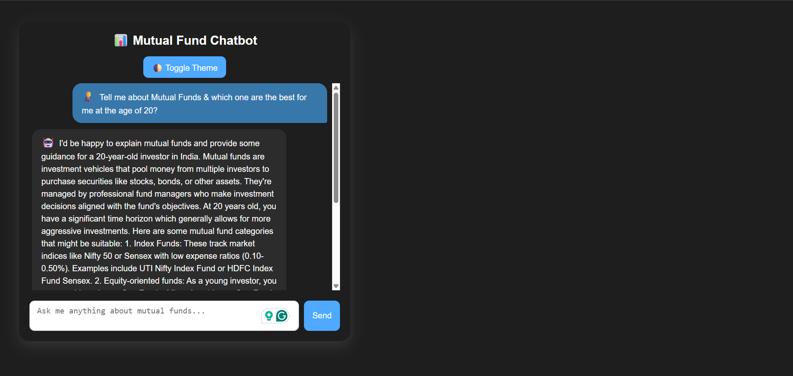

# Mutual Fund AI Chatbot

This project is an AI-powered chatbot designed to answer mutual fund-related queries using a natural-language interface. The backend is built using `n8n` and integrated into a custom front-end with HTML.

## 💡 Features
- AI chatbot trained to handle mutual fund topics
- User-friendly interface built with HTML
- n8n workflow triggers API calls to a language model
- Real-time responses embedded in chat UI

## 🔧 Tools Used
- `n8n` (self-hosted logic & API connection)
- `HTML` (chat interface)
- `JavaScript` (chat logic, event handling)
- `Anthropic Claude AI` (for responses)
- `Telegram API` (in earlier versions)

## 📦 How to Use
1. Clone/download the HTML file
2. Open it in a browser
3. Start chatting — requires backend n8n workflow connection to function fully

## 📷 Screenshot
 <!-- Add this if you upload a screenshot -->
 <!-- Add this if you upload a screenshot -->

## 🚀 Project Background
Built during my internship at Rescale Technologies, this chatbot demonstrates how AI can assist in personal finance topics like mutual fund investing. The backend runs a structured automation flow, while the front-end is designed for simplicity and usability.

---

*Built by Atharva Pandey • [GitHub](https://github.com/yourusername)*
